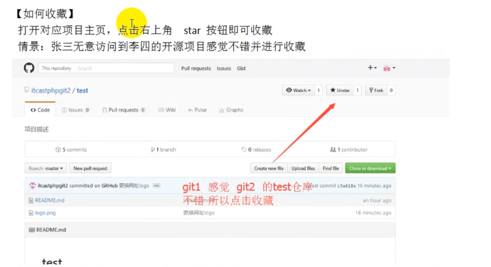
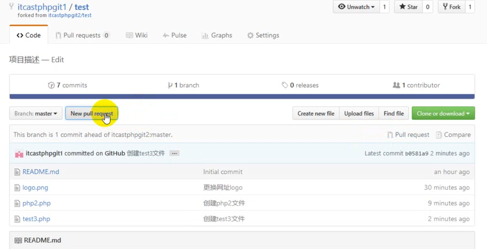
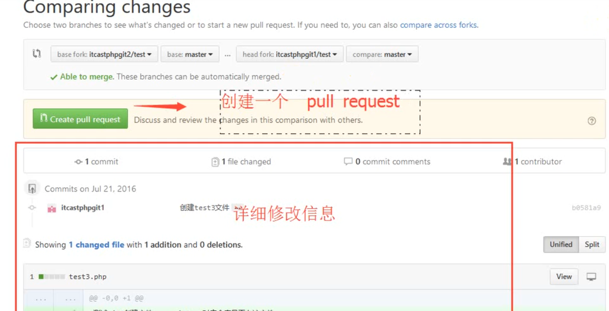
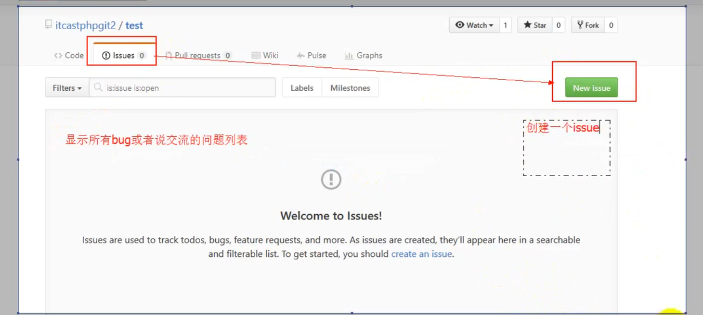
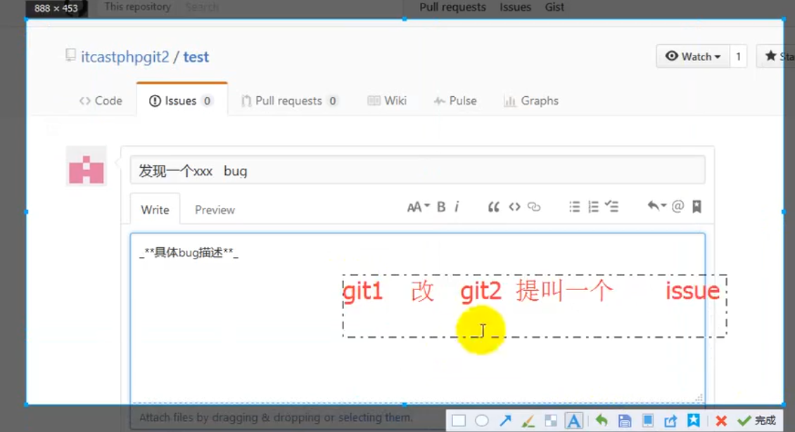
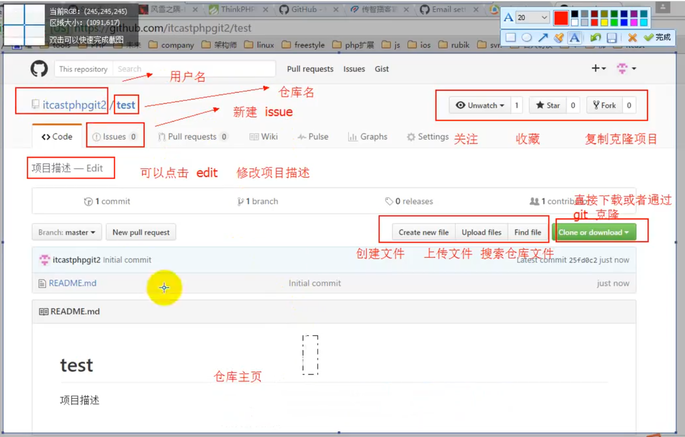
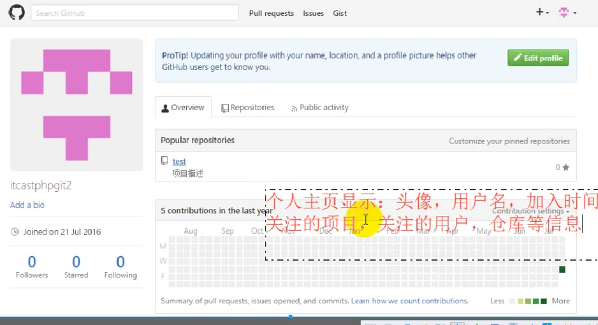
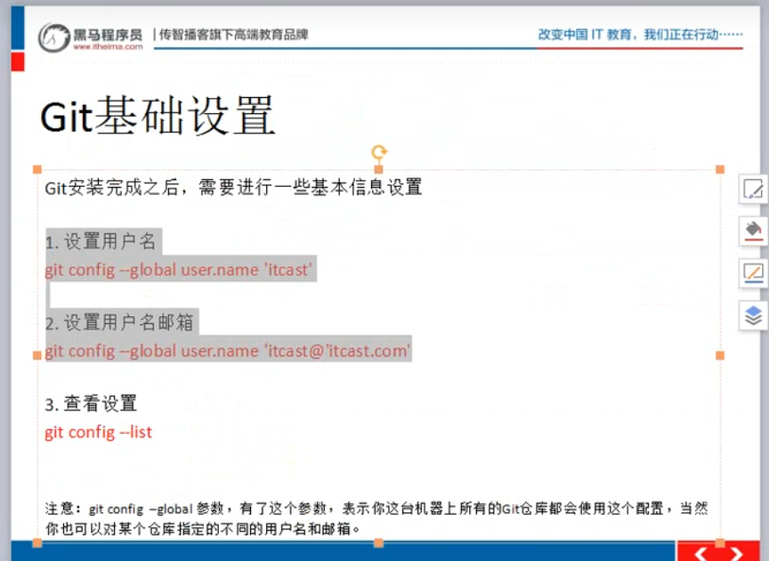
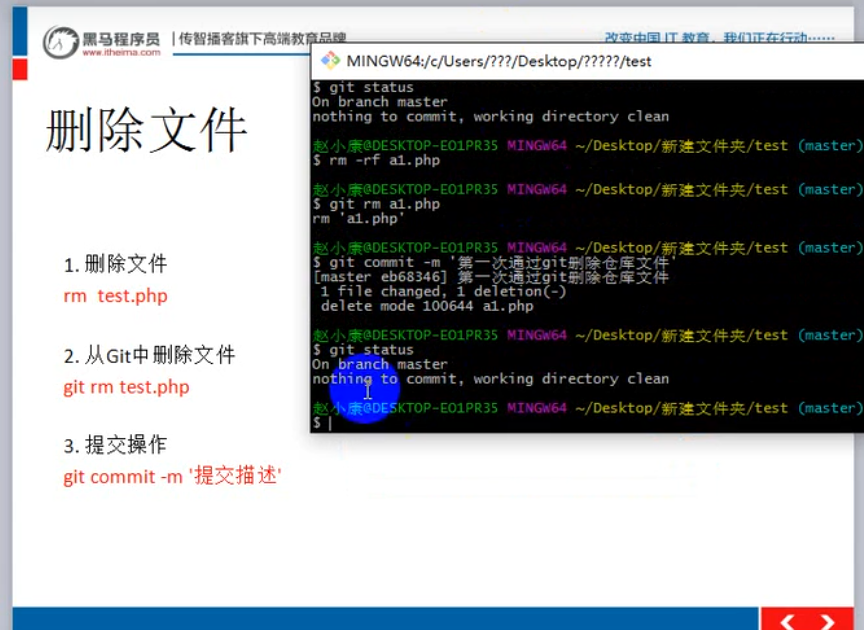

# 基本概念
    借助github托管项目代码
## 1、仓库(repository)概念：
    仓库用来存放项目代码，每个项目对应一个仓库，多个开源项目则有多个仓库
## 2、收藏(star)

## 3、复制克隆项目(fork)
    将被人的仓库复制到自己名下，会显示在个人主页下。
## 4、发起请求(pull request)
    在fork别人仓库后，然后加入自己的修改，如果想要自己的修改能够同步到原仓库中，需要提交pr(pull request)，提交后，等待原仓库管理员检测(review)代码，如果ok，那就会合入你的修改，同步到原仓库中

## 5、关注(watch)
    关注某个仓库后，如果仓库有更新，就会有个消息通知你。
## 6、事务卡片(issue)
    发现代码BUG，但是目前没有成型代码，需要讨论时使用。

## 7、Github主页
    点击github图标显示用户动态以及关注关注用户的仓库动态，右侧显示所有git库。
## 8、仓库主页
    主要显示项目代码、版本、收藏/关注/fork情况

## 9、个人主页

# GIT工作区域

# GIT基础设置

## 在文件夹内初始化git(创建git仓库)并上传内容
    执行命令git init 会生成一个.git的隐藏文件，记录git repository的相关信息
    执行命令git status查看当前工作区更新状态
    git add xx 将工作区变更内容添加到暂存区
    git commit -m '提交描述'
    git push 上传变更内容到git仓库
# 删除仓库文件

